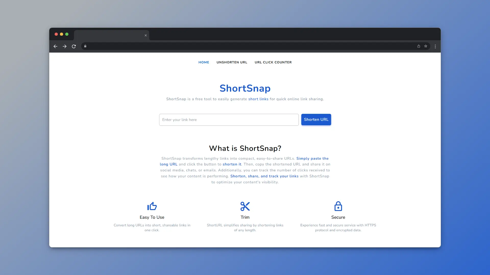

<h1 align="center">
  <br>
  <a href="https://shortsnap.vercel.app/"></a>
  <br>
  <br>
  ShortSnap
  <br>
</h1>

<h4 align="center">A fast, lightweight, and open-source URL shortener.</h4>

<p align="center">
  <a href="https://shortsnap.vercel.app/">Website</a> •
  <a href="#key-features">Key Features</a> •
  <a href="#getting-started">Getting started</a> •
  <a href="#stack">Stack</a> •
  <a href="#contribute">Contribute</a> •
  <a href="#license">License</a>
</p>



## 🚀 Key Features

- Fast and lightweight.
- Instantly shorten URLs with minimal delay.
- Easily retrieve original URLs from shortened links.
- Transparent and open source development.
- Monitor and analyze URL click data.
- Responsive design for use on any device.

## 🛠️ Getting Started

To clone and run this application, you'll need [Git](https://git-scm.com), [Node.js](https://nodejs.org/en/download/) (which comes with [npm](http://npmjs.com)), [.NET Core SDK](https://dotnet.microsoft.com/download), and [SQL Server](https://www.microsoft.com/en-us/sql-server/sql-server-downloads) installed on your computer. Follow the steps below from your command line:

```bash
# Clone this repository
$ git clone https://github.com/c-franco/shortsnap.git

# Go into the repository
$ cd shortsnap
```

### Back-end Setup:
```bash
# Navigate to the folder
$ cd shortsnap-backend

# Restore .NET dependencies
$ dotnet restore

# Update the appsettings.json file with your SQL Server connection string

# Run the application
$ dotnet run
```
### Front-end Setup:
```bash
# Navigate to the folder
$ cd ../shortsnap-frontend

# Install frontend dependencies
$ npm install

# Run the application
$ ng serve -o
```
Once the frontend and backend are started, open your browser and navigate to http://localhost:4200 to view the application.

## 📚 Stack

- [**.NET Core 8**](https://dotnet.microsoft.com/download/dotnet/8.0) - Cross-platform development platform.
- [**C#**](https://docs.microsoft.com/en-us/dotnet/csharp/) - Object-oriented multiparadigm programming language.
- [**SQL Server**](https://www.microsoft.com/en-us/sql-server/sql-server-downloads) - Relational database management system.
- [**Angular**](https://angular.io/) - Frontend development framework.
- [**TypeScript**](https://www.typescriptlang.org/) - Superset of JavaScript with static typing.
- [**Material icons**](https://fonts.google.com/icons) - Collection of icons.
- [**Vercel**](https://vercel.com) - Deployment and hosting platform.
- [**MonsterASP.NET**](https://www.monsterasp.net/) - Backend hosting provider.

## 🤝 Contribute

ShortSnap is a free and open source project. Any contributions are welcome. Here are a few ways you can help:

- [Report bugs and make suggestions.](https://github.com/c-franco/shortsnap/issues)
- [Send pull requests](https://github.com/c-franco/shortsnap/pulls) to propose improvements or new features.

## 📜 License

This application is released under the [MIT License](LICENSE).